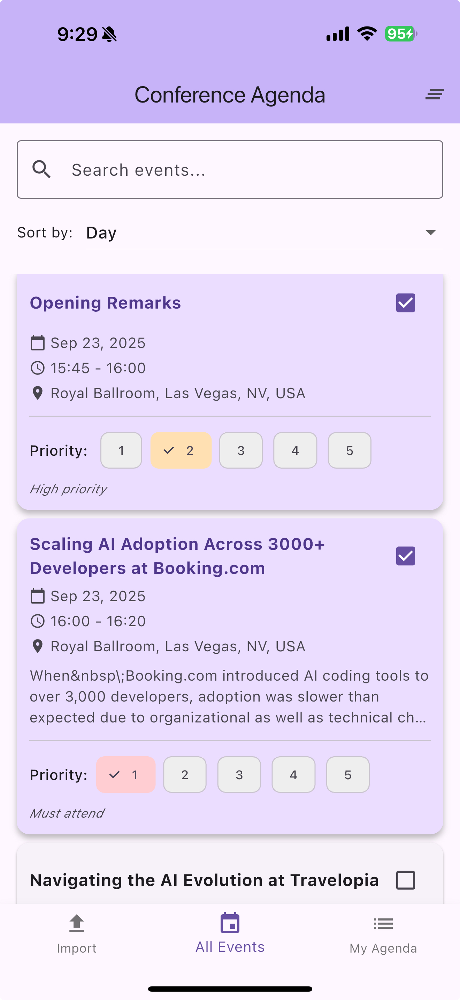
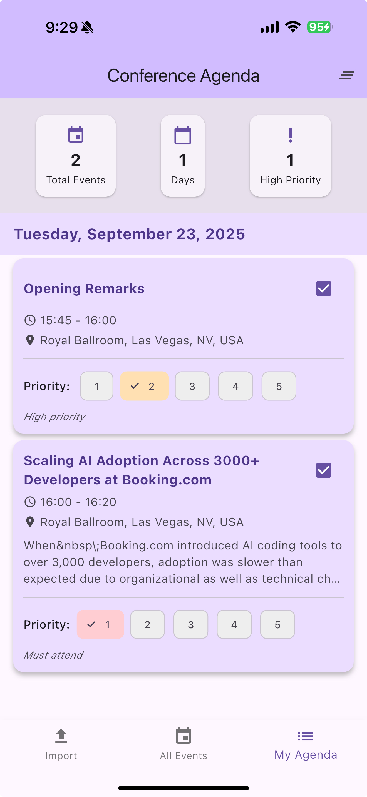

# Conference Agenda Tracker

A small Flutter iOS app built as a playground for experimenting with agentic coding workflows and rapid feature iteration. It demonstrates importing .ics calendars, browsing events, marking which ones you plan to attend, and assigning a priority to each selection. This repository is intended for learning and prototyping rather than production use.

<!-- Screenshots moved here (smaller for readability) -->
## Screenshots

App screenshots (captured from a working build):

<p align="center">
   
</p>

Events list showing grouped events and priority chips.

<p align="center">
   
</p>

Import screen with URL input and a sample ICS loaded.

## Features

- **Import Calendar Files**: Upload .ics calendar files or import from URLs
- **Event Management**: View all imported events with search and sorting capabilities
- **Event Selection**: Select which events you want to attend
- **Priority Ranking**: Assign priorities (1-5) to selected events
- **My Agenda**: View your personalized agenda organized by date and priority
- **Data Persistence**: All selections and priorities are saved locally

## Getting Started

### Prerequisites

- Flutter SDK (3.10.0 or higher)
- iOS development environment (Xcode)
- iOS device or simulator

### Installation

1. Clone or download the project
2. Navigate to the project directory
3. Install dependencies:
   ```bash
   flutter pub get
   ```

### Running the App

For iOS:
```bash
flutter run -d ios
```

### Local device testing (run on your personal iPhone)

Follow these steps to run the app directly on your personal iPhone for testing.

Prerequisites:
- A Mac with Xcode installed and opened at least once
- Your iPhone and a USB cable (or Wi‑Fi pairing configured in Xcode)
- An Apple ID added to Xcode (Preferences → Accounts). A free Apple ID works for personal testing.
- Developer Mode enabled on the iPhone (Settings → Privacy & Security → Developer Mode)

Steps:

1. Connect and trust
   - Plug your iPhone into your Mac and choose "Trust" on the device when prompted.

2. Open the iOS workspace in Xcode
   - From the project root open `ios/Runner.xcworkspace` in Xcode (important: open the workspace, not the project file).

3. Configure signing
   - Select the "Runner" target in Xcode → "Signing & Capabilities".
   - Choose your Team (your Apple ID). Enable "Automatically manage signing".
   - Ensure the Bundle Identifier is unique to your account (for example, `com.yourname.conference_agenda_tracker`).

4. (Optional) Update Podfile iOS platform
   - If you see CocoaPod deployment warnings, open `ios/Podfile` and set a modern iOS platform, e.g.:
     ```ruby
     platform :ios, '13.0'
     ```
   - Then run:
     ```bash
     cd ios
     pod install
     cd ..
     ```

5. Run from the command line
   - Verify device is detected:
     ```bash
     flutter devices
     ```
   - Run the app on the device (replace DEVICE_ID with the id from `flutter devices`, or omit to use the single connected device):
     ```bash
     flutter run -d <DEVICE_ID>
     ```

6. First-time device trust and profile
   - When launching the app the first time, you may be prompted to "Allow" your developer certificate on the device (Settings → General → Device Management or Profiles). Trust the developer profile if asked.

7. Debugging and hot reload
   - With `flutter run` active you can press `r` for hot reload and `R` for full restart. Logs are printed in the terminal.

Wireless debugging (optional):
- Pair your device in Xcode (Window → Devices and Simulators → check "Connect via network"). After pairing you can run `flutter run -d <DEVICE_ID>` over Wi‑Fi.

Notes and limitations:
- Free Apple IDs allow personal testing but provisioning profiles expire after 7 days; re-run to refresh.
- To distribute to testers or upload to TestFlight/App Store you need an Apple Developer Program (paid) membership and proper provisioning.
- If you encounter signing errors, opening the project in Xcode and using the UI fixes (select team, register device) is usually the fastest solution. Check Xcode → Window → Devices and Simulators for device pairing and logs.


## App Structure

### Screens

- **Import Calendar Screen**: Upload .ics files or import from URLs
- **Events List Screen**: View all events with search and filtering
- **My Agenda Screen**: View selected events organized by date and priority

### Key Components

- **EventProvider**: State management for events and user selections
- **CalendarService**: Handles parsing of iCalendar (.ics) files
- **StorageService**: Local data persistence using SharedPreferences
- **EventCard**: Reusable widget for displaying events

## Usage

1. **Import Calendar**: 
   - Go to the Import tab
   - Either upload a .ics file or enter a calendar URL
   - Wait for the calendar to load

2. **Select Events**:
   - Go to All Events tab
   - Browse through available events
   - Tap on events to select/deselect them
   - Use the search bar to find specific events

3. **Set Priorities**:
   - For selected events, choose a priority level (1-5)
   - 1 = Must attend, 2 = High priority, 3 = Medium, 4 = Low, 5 = Optional

4. **View Your Agenda**:
   - Go to My Agenda tab
   - See your selected events organized by date
   - Events are sorted by priority within each day

## Dependencies

- `flutter`: Flutter SDK
- `provider`: State management
- `http`: HTTP requests for URL imports
- `file_picker`: File selection functionality
- `icalendar_parser`: Parse .ics calendar files
- `shared_preferences`: Local data storage
- `intl`: Date formatting
- `path_provider`: File system paths

## Dependencies & installation

This project requires two sets of dependencies: Dart/Flutter packages (listed in `pubspec.yaml`) and platform tools for iOS. The steps below assume macOS and Xcode.

1) Install the Flutter SDK

   Follow the official macOS install guide: https://flutter.dev/docs/get-started/install

2) Verify your environment

   ```bash
   flutter doctor
   ```

3) Install CocoaPods (for iOS native dependencies)

   Using Homebrew (recommended):

   ```bash
   brew install cocoapods
   # or: sudo gem install cocoapods
   ```

4) Fetch Dart/Flutter packages

   From the project root:

   ```bash
   flutter pub get
   ```

5) Install iOS pods

   ```bash
   cd ios
   pod install
   cd ..
   ```

6) Run the app

   ```bash
   flutter devices          # list attached devices and simulators
   flutter run -d <id>      # run on a specific device
   flutter build ios --release  # build a release app (requires signing)
   ```

Notes:
- If CocoaPods complains about the deployment target, set `platform :ios, '13.0'` (or newer) in `ios/Podfile` and re-run `pod install`.
- If you only plan to run on Android or web, you can skip the iOS-specific steps.

## Screenshots

App screenshots (captured from a working build):


Events list showing grouped events and priority chips.


Import screen with URL input and sample ICS loaded.

## iOS Configuration

The app is configured for iOS with:
- Support for arbitrary network loads (for calendar URL imports)
- Proper bundle configuration
- Support for all device orientations

## Development

### Project Structure

```
lib/
├── main.dart                 # App entry point
├── models/
│   └── calendar_event.dart   # Event data model
├── providers/
│   └── event_provider.dart   # State management
├── services/
│   ├── calendar_service.dart # Calendar parsing
│   └── storage_service.dart  # Local storage
├── screens/
│   ├── home_screen.dart      # Main navigation
│   ├── import_calendar_screen.dart
│   ├── events_list_screen.dart
│   └── my_agenda_screen.dart
└── widgets/
    └── event_card.dart       # Event display component
```

### Adding Features

To extend the app:
1. Add new models in `lib/models/`
2. Extend services in `lib/services/`
3. Update the EventProvider for state management
4. Create new widgets/screens as needed

## Build for Release

To build for iOS release:
```bash
flutter build ios --release
```

## License

This project is created as a sample Flutter application for conference agenda tracking.
